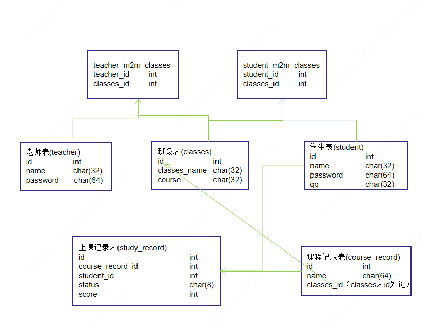
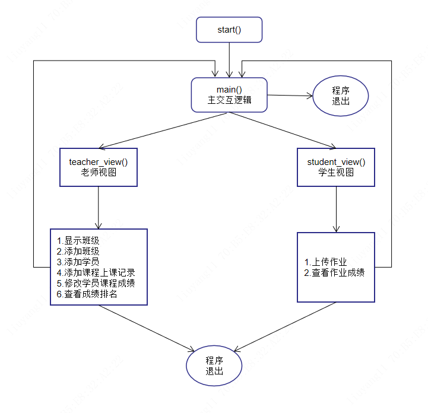

# 本周作业 学员管理系统

## 需求
- 用户角色：讲师/学员，用户登录后根据角色不同，能做的事情不同，分别如下

- 讲师视图
    - 管理班级，可创建班级，根据学员QQ号把学员加入班级
    - 可创建指定班级的上课记录，注意一节上课记录对应多条学员的上课记录，即每节课都有整班学员上课，为了记录每位学员的学习成绩，需在创建每节上课记录时，同时为这个班的每位学员创建一条上课记录。
    - 为学员批改成绩，一条一条的手动修改成绩
- 学员视图
    - 提交作业
    - 查看作业成绩
    - 一个学员可以同时属于多个班级，就像报了Linux的同时也可以报名Python一样，所以提交作业时需要先选择班级，再选择具体上课的节数
    - 附加：学员可以查看自己的班级成绩排名

## 数据库
CREATE DATABASE IF NOT EXISTS stum DEFAULT CHARSET utf8 COLLATE utf8_general_ci;


## 流程图


## 程序目录结构
```
root:[E:\刘洋工作\20200921\git\tata-LY\python\study_oldboy\Day12\work\SQLAlchemy学员管理系统]
|--bin      # 主程序目录
|      |--start.py      # 主执行程序
|      |--__init__.py
|--conf
|      |--setting.py        # 配置文件
|      |--__init__.py
|      |--__pycache__
|      |      |--setting.cpython-38.pyc
|      |      |--__init__.cpython-38.pyc
|--core     # 核心模块目录
|      |--common.py     # 共用方法
|      |--main.py       # 主交互逻辑
|      |--student_view.py       # 学生视图
|      |--teacher_view.py       # 老师视图
|      |--__init__.py
|      |--__pycache__
|      |      |--common.cpython-38.pyc
|      |      |--main.cpython-38.pyc
|      |      |--student_view.cpython-38.pyc
|      |      |--teacher_view.cpython-38.pyc
|      |      |--__init__.cpython-38.pyc
|--database         # 数据库操作目录
|      |--table_class.py    # SQLAlchemy模块
|      |--__init__.py
|      |--__pycache__
|      |      |--table_class.cpython-38.pyc
|      |      |--__init__.cpython-38.pyc
```